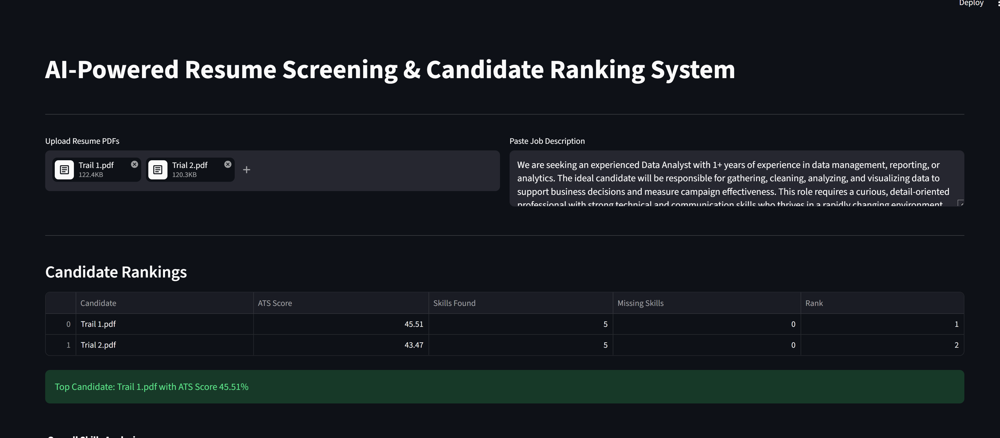
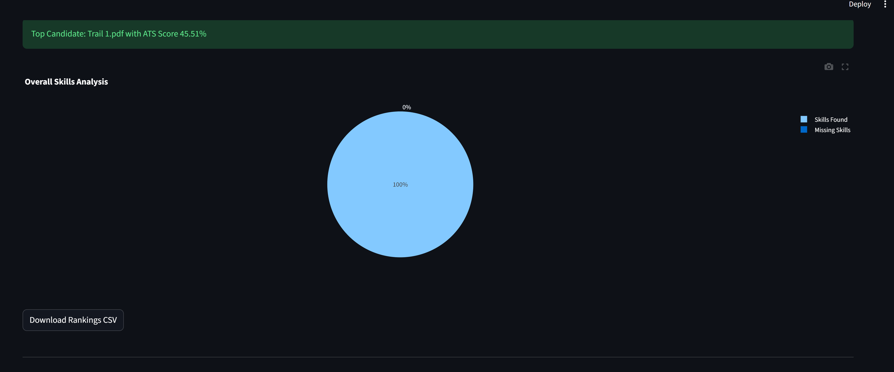
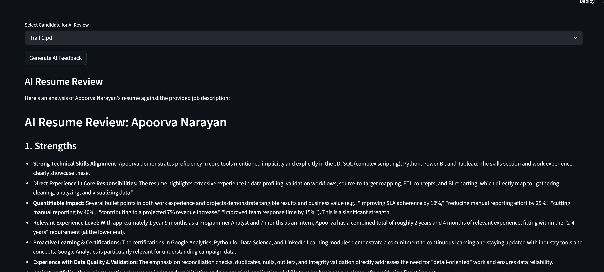

# AI-Powered Resume Screening & Candidate Ranking System

An AI-powered recruitment platform that analyzes, scores, and ranks resumes against job descriptions using NLP, ATS scoring, and Generative AI.

---

## Features

- Resume PDF Parsing
- ATS Match Score Calculation
- Skill Extraction
- Missing Skill Detection
- Candidate Ranking System
- AI Resume Feedback
- AI Interview Question Generation
- Interactive Dashboard
- CSV Export Functionality

---

## Tech Stack

- Python
- Streamlit
- Pandas
- Scikit-learn
- Plotly
- PyPDF2
- Google Gemini API
- NLP

---

## Screenshots

### Dashboard


### Candidate Ranking


### AI Feedback


---

## Installation

### Clone Repository

```bash
git clone <your_repo_link>
```

### Create Virtual Environment

```bash
python -m venv venv
```

### Activate Environment

```bash
venv\\Scripts\\activate
```

### Install Dependencies

```bash
pip install -r requirements.txt
```

### Add Environment Variables

Create `.env`

```env
GOOGLE_API_KEY=your_api_key
```

### Run Application

```bash
streamlit run app.py
```

---

## Future Enhancements

- Resume Chatbot
- Vector Database Integration
- Semantic Search
- AI Hiring Recommendation Engine
- Recruiter Authentication

---

## Author

Apoorva Narayan